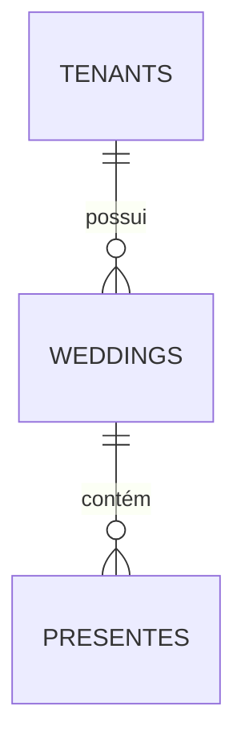

# Como Visualizar e Exportar os Diagramas

Este diretório contém 2 diagramas em formato **Mermaid** (`.mmd`):

1. **arquitetura-sistema.mmd** - Arquitetura completa do SaaS
2. **diagrama-er.mmd** - Diagrama Entidade-Relacionamento do banco

---

## 🖼️ Opções para Visualizar

### Opção 1: GitHub/GitLab (Automático)
Basta fazer commit dos arquivos `.mmd` e o GitHub renderiza automaticamente:
```bash
git add documentations/*.mmd
git commit -m "docs: adiciona diagramas de arquitetura e DER"
git push
```

### Opção 2: Mermaid Live Editor (Online)
1. Acesse: https://mermaid.live
2. Cole o conteúdo do arquivo `.mmd`
3. Clique em **"Download PNG"** ou **"Download SVG"**

### Opção 3: Mermaid Ink (URL direto)
Gera imagem via URL:
```
https://mermaid.ink/img/[código_base64_do_diagrama]
```

### Opção 4: VS Code (Plugin)
1. Instale extensão: **Markdown Preview Mermaid Support**
2. Abra o arquivo `.mmd` ou `.md`
3. Preview automático

### Opção 5: CLI (Terminal)
```bash
# Instalar Mermaid CLI
npm install -g @mermaid-js/mermaid-cli

# Converter para PNG
mmdc -i documentations/arquitetura-sistema.mmd -o documentations/arquitetura-sistema.png

mmdc -i documentations/diagrama-er.mmd -o documentations/diagrama-er.png -w 2000 -H 3000
```

---

## 🎨 Ferramentas Alternativas para DER

Se preferir ferramentas especializadas em banco de dados:

### 1. **dbdiagram.io** (Recomendado)
- Acesse: https://dbdiagram.io
- Cole o código DBML ou SQL direto
- Export PNG/PDF grátis

**Atalho rápido:**
```bash
# Copiar SQL completo
cat documentations/estrutura-saas.sql | pbcopy
```
Cole no dbdiagram.io e gera o DER automático!

### 2. **MySQL Workbench**
```bash
# Abrir Workbench
# Database → Reverse Engineer
# Seleciona conexão e gera DER visual
# File → Export → PNG
```

### 3. **DBeaver**
- Client SQL gratuito
- Botão direito no schema → View Diagram
- Export direto

### 4. **DrawSQL**
- https://drawsql.app
- Interface drag-and-drop
- Export PNG/PDF/SQL

### 5. **QuickDBD**
- https://app.quickdatabasediagrams.com
- Sintaxe simples tipo texto
- Export profissional

---

## 📐 Personalizar Diagramas

### Alterar cores (Mermaid)
No arquivo `.mmd`, edite as classes de estilo:

```mermaid
classDef primary fill:#4CAF50,stroke:#2E7D32
classDef secondary fill:#2196F3,stroke:#1565C0
```

### Ajustar tamanho (CLI)
```bash
mmdc -i arquivo.mmd -o saida.png -w 3000 -H 2000 -b transparent
```

Parâmetros:
- `-w`: largura em pixels
- `-H`: altura em pixels
- `-b`: cor de fundo (transparent, white, #hexcolor)

---

## 🚀 Exemplo Rápido

### Visualizar online (mais rápido):
```bash
# Copiar conteúdo
cat documentations/diagrama-er.mmd

# Abrir: https://mermaid.live
# Colar conteúdo
# Download PNG
```

### Gerar PNG local (melhor qualidade):
```bash
# Instalar CLI uma vez
npm install -g @mermaid-js/mermaid-cli

# Gerar diagramas
mmdc -i documentations/arquitetura-sistema.mmd -o documentations/arquitetura-sistema.png -w 2500
mmdc -i documentations/diagrama-er.mmd -o documentations/diagrama-er.png -w 2000 -H 3500
```

---

## 📊 Incluir em Documentação

### Markdown
```markdown
## Arquitetura do Sistema


## Banco de Dados

```

### README.md principal
```markdown
## 📐 Diagramas

- [Arquitetura do Sistema](./documentations/arquitetura-sistema.mmd)
- [DER do Banco](./documentations/diagrama-er.mmd)
```

---

## ⚡ Dica Pro

Use **mermaid** direto no markdown do GitHub:

````markdown

````

Renderiza automaticamente no README! 🎉

---

**Atualizado:** 28/10/2025  
**Ferramentas testadas:** Mermaid Live, dbdiagram.io, MySQL Workbench

